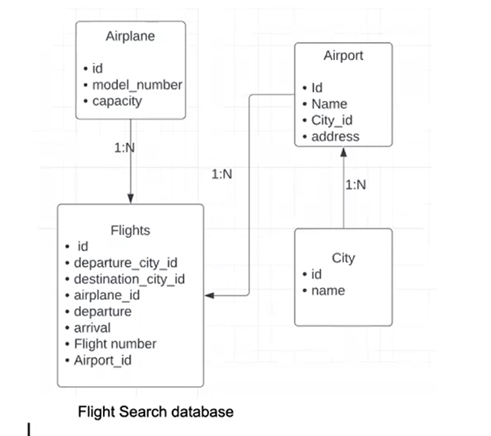

# Welcome to Flights And Search Service
- The present Micro-service is a part of an Airline Booking Backend System, tasked with performing the fundamental CRUD (Create, Read, Update, Delete) operations for entities such as flights, airplanes, cities, and airports. It implements a sophisticated data filtering mechanism, allowing users to search flights based on various parameters, including price, departure airport, and arrival airport. The solution is implemented using Node.js, Express and MySQL, ensuring reliable and scalable performance in a micro-service architecture.

### Project Setup

- Clone this Repository
- Please run the command `npm install` in the root directory of this folder path.
- Create a `.env` file in the root directory and add the following environment variable.
  - PORT = 3000
- Inside the `src/config` folder create a new file `config.json` and then add the following piece of JSON

```json
{
  "development": {
    "username": <YOUR_DB_LOGIN_NAME>,
    "password": <YOUR_DB_PASSWORD>,
    "database": "Flights_Search_DB_DEV",
    "host": "127.0.0.1",
    "dialect": "mysql"
  }
}

```

- Once you've added your db config as listed above, go to the `src` folder from your terminal and execute
  `npx sequelize db:create `
  `npx sequelize db:migrate`

## DB Design

- Airplane Table
- Flight Table
- Aitport Table
- City Table


